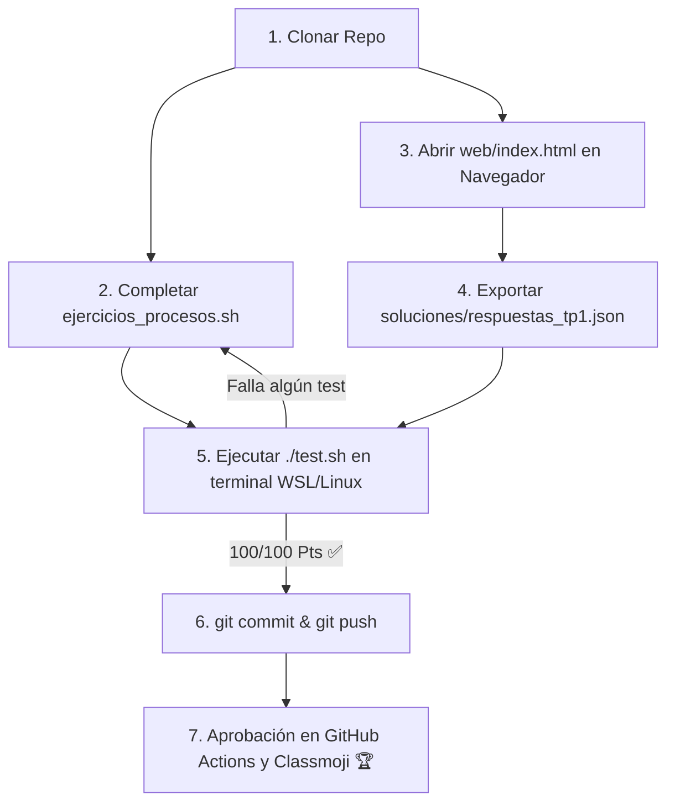

# Trabajo Práctico N° 1: Introducción, Procesos e Interbloqueos (Deadlocks)

> **Universidad Nacional de Jujuy (UNJu)**  
> **Facultad de Ingeniería — Departamento de Informática**  
> **Cátedra:** Sistemas Operativos II — Ciclo Lectivo 2026  
> **Equipo Docente:** Ing. María Fernanda Vázquez (Titular) | Ing. Fabio Damián Argañaraz Azua (JTP)  
> **Modalidad:** Individual / Autoevaluativo  

---

## 🎯 Objetivos de la Actividad

1. **Comprender la estructura del Kernel y llamadas al sistema:** Analizar la arquitectura monolítica modular de Linux, los niveles de privilegio (Modo Usuario / Modo Kernel) y el pseudo-filesystem `/proc`.
2. **Administrar Procesos y Señales en Linux:** Dominar el control de procesos en primer/segundo plano (`&`, `jobs`, `fg`, `bg`), señales POSIX (`SIGINT`, `SIGTSTP`, `SIGTERM`, `SIGKILL`) y métricas de CPU/Memoria (`ps`, `top`).
3. **Análisis de Interbloqueos (Deadlocks):** Identificar las condiciones de Coffman, modelar grafos de asignación de recursos y diseñar secuencias de ejecución concurrentes libres de bloqueos mutuos.
4. **Validación Automática:** Probar soluciones en forma local con `./test.sh` e interactuar con el módulo web (`web/index.html`) para exportar `soluciones/respuestas_tp1.json`.

---

## 📂 Estructura del Repositorio

```text
TP01/
├── .github/
│   └── workflows/
│       └── classroom.yml          # Workflow de evaluación en GitHub Actions / Classmoji
├── soluciones/
│   ├── .gitkeep
│   └── respuestas_tp1.json.template
├── web/                           # Módulo Interactivo de Teoría y Deadlocks
│   ├── index.html                 # Aplicación web para responder conceptos y simular Deadlocks
│   ├── styles.css
│   └── app.js
├── ejercicios_procesos.sh         # Script con las funciones prácticas a completar en Linux
├── test.sh                        # Suite de pruebas automatizadas (/100 Pts)
├── CHEATSHEET_PROCESOS.md         # Guía rápida de comandos de procesos y señales
├── .gitignore
└── README.md                      # Enunciado y guía de la actividad
```

---

## 🚀 Flujo de Trabajo Paso a Paso



### Paso 1: Resolver la Práctica de Consola en `ejercicios_procesos.sh`
Abra el proyecto en **Visual Studio Code** y complete el código dentro de cada función en [`ejercicios_procesos.sh`](./ejercicios_procesos.sh):
* **Ejercicio 1:** Extracción de versión del kernel e información de CPU.
* **Ejercicio 2:** Top 5 de procesos por consumo de memoria RAM con `ps aux`.
* **Ejercicio 3:** Creación de procesos en segundo plano (`sleep &`), captura de PID (`$!`), lectura de estado en `/proc/$PID/status` y envío de señal `kill`.
* **Ejercicio 4:** Inspección de métricas del propio proceso desde `/proc/$$/status`.

### Paso 2: Resolver la Teoría e Interbloqueos en `web/index.html`
1. Haga doble clic en el archivo [`web/index.html`](./web/index.html) para abrirlo en su navegador.
2. Complete sus datos personales (Nombre, Legajo y GitHub).
3. Responda las preguntas conceptuales y analice las secuencias de asignación de recursos para los **Escenarios A y B de Deadlocks**.
4. Haga clic en **`📥 Descargar respuestas_tp1.json`** y mueva el archivo descargado a la carpeta `soluciones/` de su repositorio.

### Paso 3: Ejecutar la Suite de Pruebas Local
En su terminal de **Ubuntu (WSL)** o terminal Linux, ejecute:
```bash
./test.sh
```

### Paso 4: Entrega (Git Push)
Cuando el test muestre **100 / 100 Pts**, confirme y envíe su solución a GitHub:
```bash
git add ejercicios_procesos.sh soluciones/respuestas_tp1.json
git commit -m "Solución completa TP 1"
git push origin main
```
